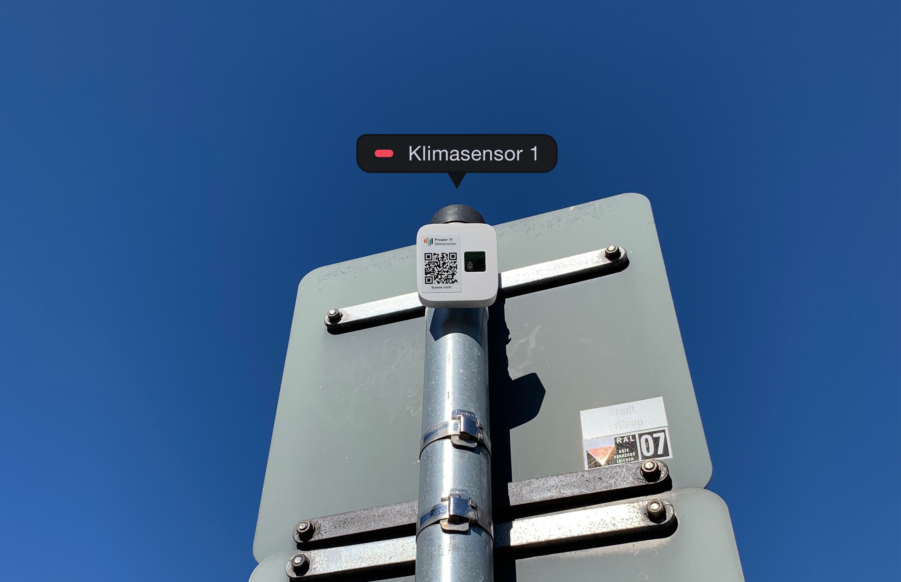
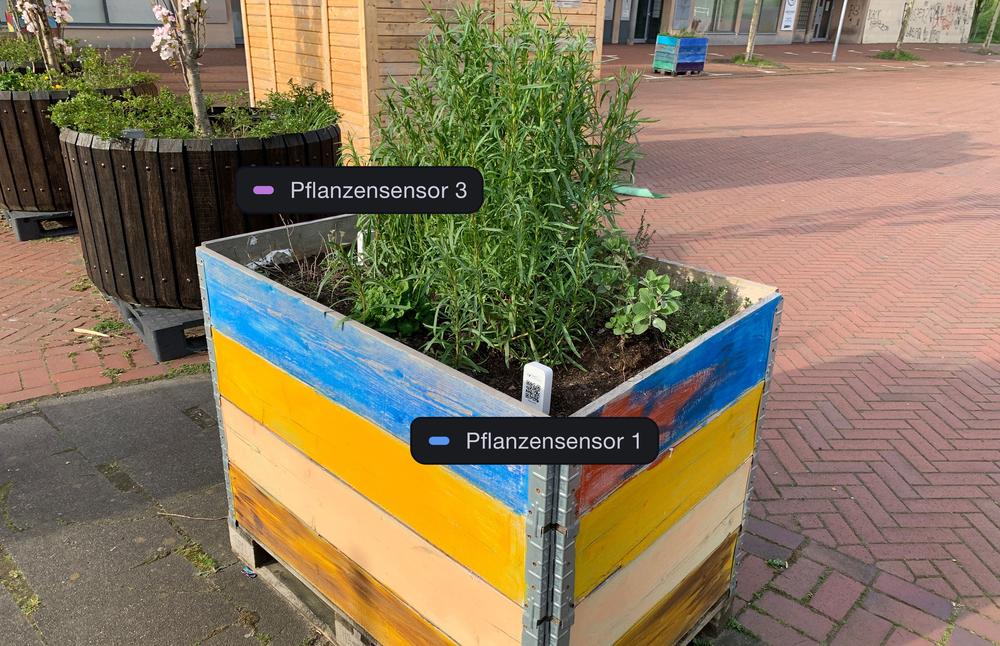
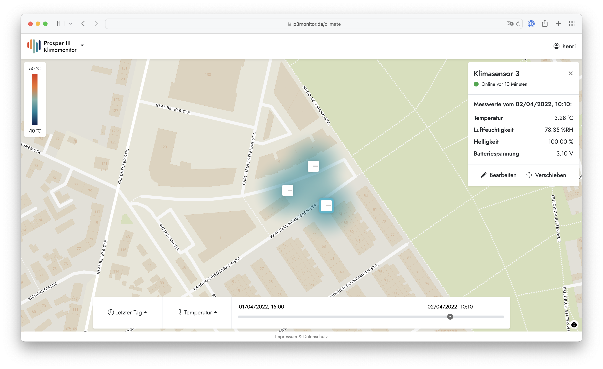
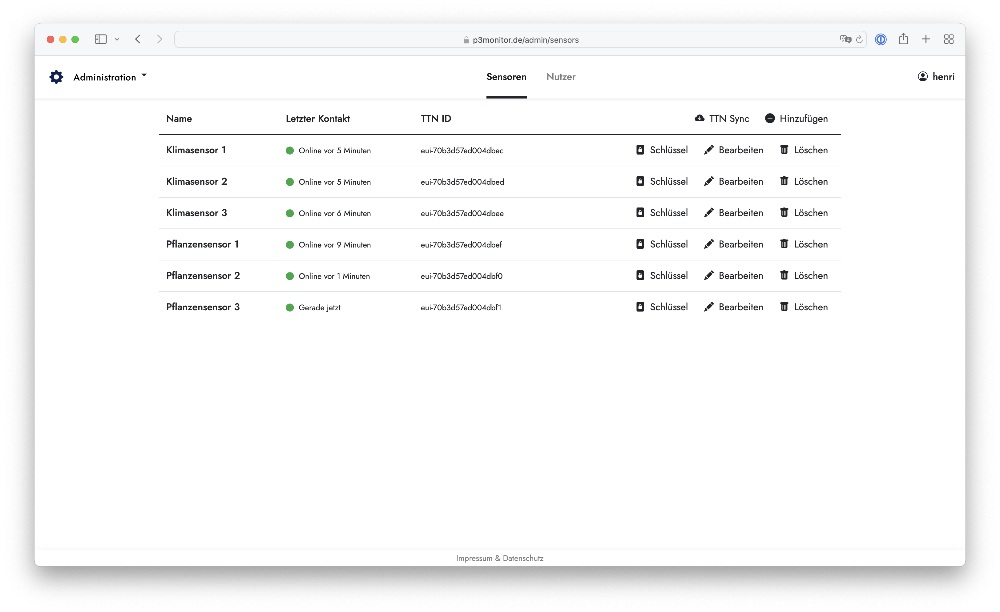

 
 
 

# Prosper III Monitor

This repository contains the source code accompanying my master's thesis "Entwicklung einer digitalen Lösung zur Unterstützung von Tactical Urbanism auf Prosper III" (Development of a Digital Solution to Support Tactical Urbanism on Prosper III) at [Hochschule Ruhr West](https://www.hochschule-ruhr-west.de/). It includes hardware designs and embedded software for LoRaWAN-based sensor nodes to collect microclimate and irrigation data, as well as a web application and infrastructure to manage sensor nodes and view data.

 
 

Climate sensor nodes contain an ambient light sensor, a temperature and humidity sensor, as well as an optional infrared temperature sensor which can be used to measure surface temperatures from afar.

 
 
 

Irrigation sensor nodes use a capacitive soil moisture sensor and the microcontrollers' embedded temperature sensor to monitor raised beds.

 
 

## Frontend

